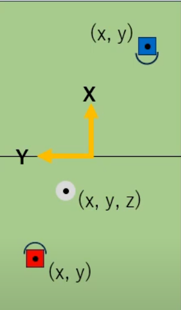
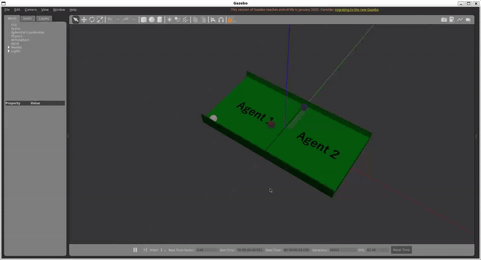
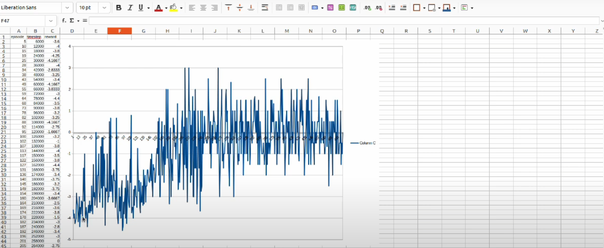

## MULTI-AGENT-RL-SIMULATION
In this project we train a multi - agent robot to play a simple game against each other using the Reinforcement Learning using PPO gradient.
This is then demonstrted in gazebo simulation using ROS2 humble 

#### Objective 
The objective of the game is to get a point(shoot the ball outside the back line of the oppponent's court)

#### Obeservation space: Both agent's positions (x,y) and ball position (x,y,z)
#### State: Array of current and previous positions of the agents and the ball.
Actions: An agent is able to move in x,y direction. The agent can also move a semicircle part in front of it to punch the ball harder.
<div align="center">
    
</div>

## Installation 
Open you terminal and clone:
```shell
https://github.com/IsraelAfriyie-dev/Multi-Agent-RL-Simulation.git
``` 

Build your work space: 
```shell
Colcon build
source install/setup
```
Run:
``` shell
ros2 launch robot_gazebo main.launch.xml
```
Open another terminal and run the training Set:
``` shell
ros2 run reinforcement_learning ppo_train.py
```
Training takes about 20hrs to complete, and  after that you can check the log file to see the profile of the training 

Run the test Set after the training is complete:
``` shell
ros2 run reinforcement_learning ppo_test.py
```

                    

